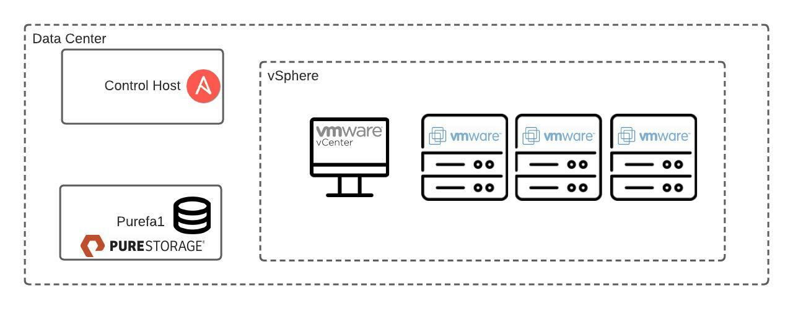

# Pure and Ansible Workshop

Repository associated with Pure and Ansible livestream workshop on March 22, 2022

Link to event is [here.](https://www.wwt.com/event/6213ec44a3a7ae0084b645ed)

This demo uses the WWT on-demand [Pure Ansible Automation Lab](https://www.wwt.com/lab/pure-ansible-automation-lab) hosted on WWT's digital platform.

In this lab we will get familiar with Ansible concepts while automation Pure Storage operational tasks. At the end of this lab, you'll have learned how to:

* gather information about a Pure Flash Array
* configure and manage volumes
* configure and manage hosts and host groups
* configure and manage volume snapshots
* Mount a volume as a datastore in vSphere
* Retrieve data from an outside source using an Ansible lookup plugin
* Use assertions to verify input data
* Use ansible to build documentation about our environment

The environment we will be automating looks like this:



python3 required

To install the latest version of Ansible and other python dependencies:

```
pip install -r dependencies/requirements.txt
```

To install the latest modules for Pure and VMware:

```
ansible-galaxy install -r dependencies/requirements.yml
```
